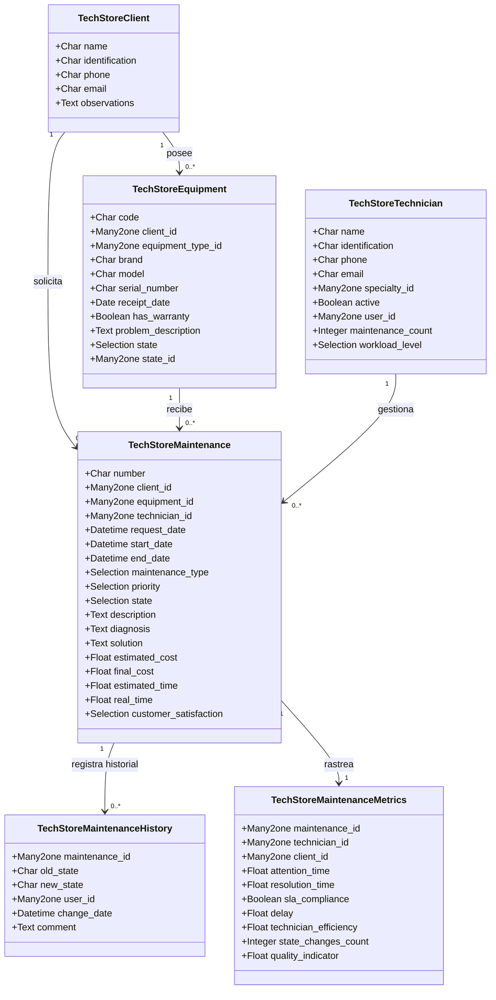

# TechStore Mantenimiento - Arquitectura Técnica

Este documento detalla el diseño del sistema, los modelos de base de datos, las relaciones, las transiciones de la máquina de estados y las extensiones personalizadas del frontend para el módulo **TechStore Mantenimiento** de Odoo 18.

---

## 1. Modelo de Entidad-Relación de Alto Nivel

El módulo consta de **8 modelos de base de datos** y **2 modelos transitorios** (wizards). A continuación se muestra la estructura de relaciones lógicas:



---

## 2. Desglose de Modelos

### Modelos de Negocio Principales
1. **`techstore.client`** ([client.py](file:///d:/universidad/septimo/GCS/TechStore_Maintenance/addons/techstore_maintenance/models/client.py))
   - Almacena la información de contacto de clientes naturales o jurídicos.
   - Restringido por un campo único de identificación (RUC o cédula).
2. **`techstore.equipment`** ([equipment.py](file:///d:/universidad/septimo/GCS/TechStore_Maintenance/addons/techstore_maintenance/models/equipment.py))
   - Representa los activos físicos de hardware recibidos para soporte técnico.
   - Atributos clave: marca, modelo, número de serie único, estado físico (`state_id`) y estado de proceso (`state`).
3. **`techstore.technician`** ([technician.py](file:///d:/universidad/septimo/GCS/TechStore_Maintenance/addons/techstore_maintenance/models/technician.py))
   - Registra el perfil del equipo técnico.
   - Se vincula directamente con los usuarios del sistema Odoo (`res.users`).
   - Calcula dinámicamente la cantidad de mantenimientos asignados activos y el nivel de carga laboral (`low`, `medium`, `high`, `critical`).
4. **`techstore.maintenance`** ([maintenance.py](file:///d:/universidad/septimo/GCS/TechStore_Maintenance/addons/techstore_maintenance/models/maintenance.py))
   - Modelo central del módulo. Hereda de `mail.thread` y `mail.activity.mixin` para habilitar el seguimiento colaborativo y chatter (mensajería interna).
   - Coordina la relación entre clientes, equipos, técnicos, cronograma, costos y feedback.

### Modelos de Auditoría y Métricas
5. **`techstore.specialty`** ([specialty.py](file:///d:/universidad/septimo/GCS/TechStore_Maintenance/addons/techstore_maintenance/models/specialty.py)): Catálogo de especialidades técnicas.
6. **`techstore.equipment.type`** ([equipment_type.py](file:///d:/universidad/septimo/GCS/TechStore_Maintenance/addons/techstore_maintenance/models/equipment_type.py)): Categoría del equipo (ej. Portátil, Servidor, Impresora).
7. **`techstore.equipment.state`** ([equipment_state.py](file:///d:/universidad/septimo/GCS/TechStore_Maintenance/addons/techstore_maintenance/models/equipment_state.py)): Estados físicos en la recepción (por defecto "Nuevo").
8. **`techstore.maintenance.history`** ([history.py](file:///d:/universidad/septimo/GCS/TechStore_Maintenance/addons/techstore_maintenance/models/history.py)): Bitácora estricta de auditoría que registra cada cambio de estado, el usuario responsable y sus comentarios.
9. **`techstore.maintenance.metrics`** ([metrics.py](file:///d:/universidad/septimo/GCS/TechStore_Maintenance/addons/techstore_maintenance/models/metrics.py)): Hoja de métricas calculada en tiempo real vinculada en relación 1 a 1 con cada ticket.

---

## 3. Máquina de Estados del Ciclo de Vida del Mantenimiento

El ticket de mantenimiento transiciona a través de 6 etapas secuenciales:

```mermaid
stateDiagram-v2
    [*] --> nuevo : Crear (equipo: Ingresado)
    nuevo --> asignado : Asignar Técnico (Supervisor/Admin)
    nuevo --> en_proceso : Iniciar Proceso
    asignado --> en_proceso : Iniciar Proceso (equipo: En Reparación)
    en_proceso --> pendiente : Poner en Espera (ej. por repuestos)
    pendiente --> en_proceso : Reanudar
    en_proceso --> finalizado : Completar (requiere validaciones; equipo: Reparado)
    pendiente --> finalizado : Completar (requiere validaciones; equipo: Reparado)
    nuevo --> cancelado : Cancelar
    asignado --> cancelado : Cancelar
    en_proceso --> cancelado : Cancelar
    pendiente --> cancelado : Cancelar
    finalizado --> [*]
    cancelado --> [*]
```



### Flujo del Asistente para Registro de Comentarios
Cada vez que se inicia un cambio de estado—ya sea mediante botones en la vista formulario o arrastrando tarjetas en el tablero Kanban—el sistema obliga al usuario a ingresar un comentario explicativo:
1. La acción del usuario llama al método de Python `_open_state_wizard(target_state, default_comment)` en el modelo `techstore.maintenance`.
2. El método verifica los prerrequisitos (ej. es obligatorio tener un técnico asignado para pasar a `en_proceso`).
3. Si es válido, instancia un registro en el wizard transitorio `techstore.maintenance.state.wizard` y retorna una acción de ventana diseñada para abrirse como un modal emergente (`'target': 'new'`).
4. Al hacer clic en "Confirmar", la función del asistente `action_confirm()` actualiza el estado del mantenimiento inyectando el comentario personalizado mediante el contexto de ejecución:
   ```python
   self.maintenance_id.with_context(custom_comment=self.comment).write({'state': self.new_state})
   ```
5. El método `write()` (o `create()`) de `techstore.maintenance` intercepta la transacción, procesa efectos secundarios (como actualizar fechas e iniciar la sincronización de estado del equipo) y llama a `_create_history_log()` para generar una entrada inalterable en `techstore.maintenance.history`.

---

## 4. Patch JS Personalizado para Drag-and-Drop en Kanban

La vista Kanban predeterminada de Odoo guarda los cambios de estado en la base de datos de manera inmediata al arrastrar una tarjeta. Para obligar a que se abra nuestro asistente de comentarios al arrastrar tarjetas, el módulo incluye un controlador de JavaScript extendido:
* **Ruta del recurso:** `techstore_maintenance/static/src/js/techstore_kanban.js`
* **Punto de interrupción:** Sobrescribe la función `dropRecord(record, targetColumn)`.

### Funcionamiento:
1. **Validación del modelo:** Verifica si el modelo manipulado es `'techstore.maintenance'`. Si es de otro tipo, delega en la implementación nativa (`super.dropRecord`).
2. **Llamada RPC:** Invoca al backend de Odoo mediante llamadas al servicio ORM en JS (`this.orm.call`) apuntando al método de Python `_open_state_wizard`:
   ```javascript
   const action = await this.orm.call(
       'techstore.maintenance',
       '_open_state_wizard',
       [[recordId], targetState, defaultComment]
   );
   ```
3. **Despliegue del Modal:** En lugar de guardar directamente el cambio, ejecuta la acción del wizard retornada para abrir el formulario emergente en la UI:
   ```javascript
   await this.actionService.doAction(action, {
       onClose: async () => { ... }
   });
   ```
4. **Navegación Post-Transición:** En el callback `onClose` del modal:
   * Si el estado realmente cambió (es decir, el usuario completó el formulario del modal y confirmó), redirige la interfaz del usuario directamente a la **Vista Formulario** del ticket para que pueda completar los detalles adicionales requeridos:
     ```javascript
     await this.actionService.doAction({
         type: 'ir.actions.act_window',
         res_model: 'techstore.maintenance',
         res_id: recordId,
         views: [[false, 'form']],
         target: 'current',
     });
     ```
   * Si el estado no cambió (el usuario canceló el modal), recarga los datos del tablero Kanban para regresar la tarjeta a su columna original.
