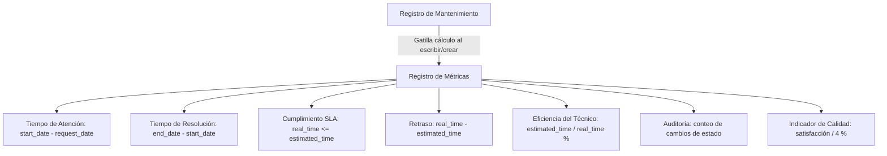

# TechStore Mantenimiento - Métricas y Motor de Reportes

Este documento detalla la lógica de cálculo de las métricas de telemetría y la arquitectura técnica para la generación de reportes en formatos PDF y Excel (XLSX) dentro de **TechStore Mantenimiento**.

---

## 1. Motor de Métricas de Servicio en Tiempo Real

Los datos de telemetría de rendimiento se almacenan en el modelo `techstore.maintenance.metrics` ([metrics.py](file:///d:/universidad/septimo/GCS/TechStore_Maintenance/addons/techstore_maintenance/models/metrics.py)), el cual está vinculado mediante una relación uno a uno con cada ticket de mantenimiento. Odoo calcula de manera automática los siguientes indicadores:



### Especificación de Fórmulas Matemáticas:

* **Tiempo de Atención (Attention Time):** Mide la velocidad de respuesta desde el ingreso hasta el inicio del trabajo.
  $$\text{Tiempo de Atención} = \frac{\text{Fecha de Inicio} - \text{Fecha de Solicitud}}{\text{3600 segundos}}$$
* **Tiempo de Resolución (Resolution Time):** Representa la duración real acumulada de las tareas de reparación. Corresponde al valor del campo computado `real_time` del ticket de mantenimiento (diferencia en horas entre `end_date` y `start_date`).
* **Cumplimiento SLA (SLA Compliance):** Evalúa si la reparación se completó dentro del tiempo estimado inicial.
  $$\text{Cumplimiento SLA} = \text{Tiempo Real} \le \text{Tiempo Estimado}$$
  *Si no se registra un tiempo estimado, el cumplimiento por defecto se evalúa como `True`.*
* **Retraso (Delay):** Calcula el exceso de tiempo empleado respecto a la estimación original.
  $$\text{Retraso} = \max(0.0, \text{Tiempo Real} - \text{Tiempo Estimado})$$
* **Eficiencia del Técnico:** Mide la desviación del rendimiento respecto a la estimación estándar.
  $$\text{Eficiencia del Técnico} = \left(\frac{\text{Tiempo Estimado}}{\text{Tiempo Real}}\right) \times 100$$
  *Si el mantenimiento no ha registrado tiempo de resolución, la eficiencia por defecto es del $100\%$.*
* **Conteo de Cambios de Estado:** Suma la cantidad total de transiciones registradas en la bitácora de auditoría (`techstore.maintenance.history`) asociadas al ticket.
* **Indicador de Calidad:** Normaliza en escala porcentual el nivel de satisfacción reportado por el cliente.
  $$\text{Indicador de Calidad} = \left(\frac{\text{Satisfacción del Cliente}}{4}\right) \times 100$$
  *Donde Malo = 1, Regular = 2, Bueno = 3, Excelente = 4. Los tickets no calificados se evalúan como $0\%$.*

---

## 2. Arquitectura del Wizard de Reportes

La generación de reportes se procesa a demanda del usuario mediante el modelo transitorio (Transient Model) `techstore.maintenance.report.wizard` ([report_wizard.py](file:///d:/universidad/septimo/GCS/TechStore_Maintenance/addons/techstore_maintenance/models/report_wizard.py)).

### Limitaciones de Seguridad por Rol:
* **Administrador / Supervisor:** Tienen libre acceso para elegir entre el reporte **Mantenimientos (Detallado)** y el reporte consolidado **General del Sistema (Consolidado)**. Pueden aplicar filtros por técnico, rango de fechas o estado.
* **Técnico:** Restringido por defecto al reporte **Mantenimientos (Detallado)**. El método `default_get` bloquea la selección de técnico a su propio perfil de usuario y la interfaz de Odoo oculta el botón para generar reportes generales del sistema.

---

## 3. Motor de Reportes PDF QWeb

* **Acción de Generación:** `action_generate_pdf()`
* **Ubicación de la Plantilla:** `views/report_maintenance_templates.xml`
* **Modelo Parser Abstracto:** `report.techstore_maintenance.report_maintenance_template`

Este motor filtra los tickets en base a los criterios definidos en el wizard, calcula las estadísticas agrupadas (costo estimado total, costo final total, promedio de horas de resolución) y compila las vistas HTML usando el motor QWeb nativo de Odoo, el cual es renderizado en formato PDF por la librería de sistema `wkhtmltopdf`.

---

## 4. Motor de Exportación a Excel (XLSX)

* **Acción de Generación:** `action_generate_excel()`
* **Librería de Python:** `xlsxwriter`
* **Flujo de Descarga:** Genera el flujo binario en memoria usando `io.BytesIO`, lo codifica en Base64 en el campo transitorio `excel_file` y retorna una redirección de descarga nativa:
  ```python
  return {
      'type': 'ir.actions.act_url',
      'url': '/web/content/?model=techstore.maintenance.report.wizard&id=...',
      'target': 'self',
  }
  ```

### Estructura Dinámica del Libro de Excel:

#### A. Reporte Detallado de Mantenimiento (Pestaña Única)
* **Encabezado:** Diseñado con el color institucional `#1f4e79` y letras en blanco.
* **Sección de Metadatos:** Indica la fecha de generación, el usuario que generó el reporte y los filtros aplicados.
* **Tarjetas KPI Consolidadas:** Celdas combinadas de resumen rápido que muestran el total de mantenimientos filtrados, el costo acumulado final y el tiempo promedio real invertido.
* **Tabla de Datos:** Columnas con el número de ticket, cliente, equipo, técnico, fechas de solicitud y fin, tipo de servicio, prioridad, estado del ticket, costos (estimados y reales) y horas empleadas.

#### B. Reporte General del Sistema (Libro de Excel Multi-Pestaña)
Genera 4 pestañas formateadas para ofrecer una auditoría completa de la plataforma:
1. **"Resumen General":** 
   * KPIs generales (volumen de tickets, costo acumulado de facturación, equipos totales, técnicos activos).
   * Tablas de distribución de frecuencias y porcentajes: Mantenimientos por Estado de flujo y Equipos por Estado físico de proceso.
2. **"Mantenimientos":** Listado de tickets filtrados con detalle de facturación y cronograma.
3. **"Equipos":** Listado de equipos en el sistema, mostrando código único, cliente propietario, tipo de equipo, marca, modelo, número de serie, fecha de recepción y si cuenta con garantía activa.
4. **"Técnicos":** Directorio del personal técnico indicando cédula, teléfono, correo de usuario, especialidad, total de tickets activos asignados y nivel de carga laboral.

### Colores de Estilos Utilizados:
* **Fondo de Encabezados:** `#2f5597` (Azul Medio)
* **Fondo de Bloque de Título:** `#1f4e79` (Azul Oscuro)
* **Fondo de Tarjetas KPI:** `#f2f2f2` (Gris Claro)
* **Formatos de Números:** `num_format: '$#,##0.00'` para costos financieros, `num_format: '0.0%'` para ratios de distribución.
* **Auto-Ajuste:** Calcula dinámicamente el ancho óptimo de las columnas según la longitud del texto para evitar que se visualicen truncadas (`###`).
