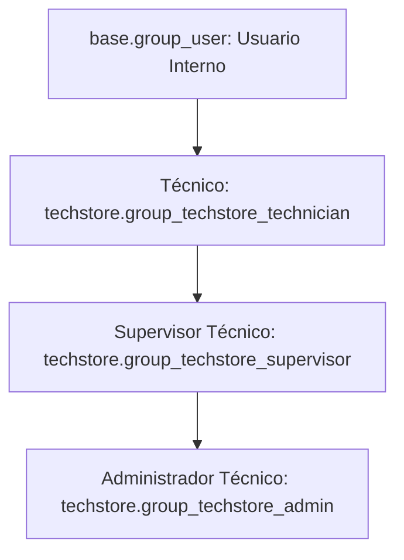

# TechStore Mantenimiento - Guía de Roles y Permisos de Seguridad

Este documento describe la arquitectura de seguridad del módulo **TechStore Mantenimiento**, incluyendo grupos de seguridad, Listas de Control de Acceso (ACLs), reglas de registro para filtrado a nivel de fila y restricciones en la interfaz de usuario.

---

## 1. Grupos de Seguridad de Odoo

El módulo define una jerarquía de roles dentro de la categoría de módulo **TechStore Mantenimiento** en [techstore_security.xml](file:///d:/universidad/septimo/GCS/TechStore_Maintenance/addons/techstore_maintenance/security/techstore_security.xml).



### Detalle de la Jerarquía:
1. **Técnico**
   - Asignado a los técnicos que realizan el mantenimiento de los equipos.
   - Hereda los permisos del grupo nativo de Usuario Interno de Odoo.
   - Vinculado a un registro del modelo `techstore.technician` mediante el campo `user_id`.
2. **Supervisor Técnico**
   - Hereda todos los permisos del rol de Técnico.
   - Puede ver todos los registros de clientes, equipos y técnicos, asignar trabajos a los técnicos y acceder a los asistentes de reportes globales del sistema.
3. **Administrador Técnico**
   - Hereda todos los permisos del rol de Supervisor.
   - Posee privilegios completos sobre todos los modelos (CRUD completo, incluyendo eliminación y modificación de logs del historial).
   - Asignado por defecto a las cuentas de administrador del sistema.

---

## 2. Matriz de Permisos (ACLs)

Los permisos CRUD por modelo están definidos en [ir.model.access.csv](file:///d:/universidad/septimo/GCS/TechStore_Maintenance/addons/techstore_maintenance/security/ir.model.access.csv):

| Nombre del Modelo | Descripción del Modelo | Técnico (Grupo Técnico) | Supervisor (Grupo Supervisor) | Administrador (Grupo Admin) |
| :--- | :--- | :---: | :---: | :---: |
| `techstore.technician` | Registro de Técnicos | Solo Lectura | Leer/Escribir/Crear | CRUD |
| `techstore.equipment` | Registro de Equipos | Leer/Escribir/Crear | Leer/Escribir/Crear | CRUD |
| `techstore.maintenance` | Ticket de Mantenimiento | Leer/Escribir/Crear | Leer/Escribir/Crear | CRUD |
| `techstore.maintenance.history` | Historial de Estados (Auditoría) | Solo Lectura | Solo Lectura | CRUD |
| `techstore.maintenance.metrics` | Métricas de Rendimiento | Solo Lectura | Leer/Escribir/Crear | CRUD |
| `techstore.client` | Catálogo de Clientes | Leer/Escribir/Crear | Leer/Escribir/Crear | CRUD |
| `techstore.specialty` | Especialidades Técnicas | Leer/Escribir/Crear | Leer/Escribir/Crear | CRUD |
| `techstore.equipment.type` | Tipos de Equipos | Solo Lectura | Leer/Escribir/Crear | CRUD |
| `techstore.equipment.state` | Estados Físicos de Equipos | Solo Lectura | Leer/Escribir/Crear | CRUD |
| `techstore.maintenance.state.wizard`| Wizard de Cambio de Estado | CRUD | CRUD | CRUD |
| `techstore.maintenance.report.wizard`| Wizard de Reportes | CRUD | CRUD | CRUD |

*Nota: **CRUD** representa todos los permisos (Leer, Escribir, Crear, Eliminar). Para proteger los flujos, el grupo Supervisor no cuenta con permisos de eliminación en la mayoría de los modelos.*

---

## 3. Reglas de Registro (Filtros a Nivel de Fila)

Las reglas de registro controlan qué filas de la base de datos puede ver o modificar un usuario de acuerdo con su rol. Están definidas en [techstore_security.xml](file:///d:/universidad/septimo/GCS/TechStore_Maintenance/addons/techstore_maintenance/security/techstore_security.xml):

### A. Regla de Aislamiento para Técnicos
* **ID:** `rule_techstore_maintenance_technician`
* **Modelo:** `techstore.maintenance`
* **Grupos:** `techstore_maintenance.group_techstore_technician`
* **Fuerza de Dominio:**
  ```python
  ['|', ('technician_id.user_id', '=', user.id), ('create_uid', '=', user.id)]
  ```
* **Efecto:** Los técnicos solo pueden visualizar, crear o modificar tickets de mantenimiento en los cuales estén asignados como técnicos responsables, o que ellos mismos hayan creado (rastreado por `create_uid`). Tienen deshabilitada la eliminación (`perm_unlink = False`).

### B. Regla Global para Supervisores y Administradores
* **ID:** `rule_techstore_maintenance_all`
* **Modelo:** `techstore.maintenance`
* **Grupos:** `techstore_maintenance.group_techstore_supervisor`, `techstore_maintenance.group_techstore_admin`
* **Fuerza de Dominio:**
  ```python
  [(1, '=', 1)]
  ```
* **Efecto:** Otorga visibilidad global sobre todos los tickets de mantenimiento del sistema a los supervisores y administradores.

---

## 4. Guardias de Seguridad en UI y Lógica de Negocio

Además de las ACLs y las Reglas de Registro, el código en Python y XML aplica restricciones lógicas en tiempo de ejecución:

### A. Asignación Automática al Crear Mantenimientos
En [maintenance.py](file:///d:/universidad/septimo/GCS/TechStore_Maintenance/addons/techstore_maintenance/models/maintenance.py#L98-L113), cuando un usuario del grupo Técnico crea una solicitud de mantenimiento, el sistema localiza su registro de técnico y lo asigna automáticamente en `technician_id`. Esto asegura que el ticket cumpla de inmediato con la regla de aislamiento y permanezca visible para el técnico que lo creó.

### B. Campo de Técnico de Solo Lectura
* **Campo Computado:** `is_technician_readonly`
* **Lógica:** Retorna `True` si el usuario actual es un técnico y no pertenece a los grupos de Supervisor o Administrador.
* **Declaración XML:** En [maintenance_views.xml](file:///d:/universidad/septimo/GCS/TechStore_Maintenance/addons/techstore_maintenance/views/maintenance_views.xml#L162):
  ```xml
  <field name="technician_id" options="{'no_create': True}" readonly="is_technician_readonly"/>
  ```
* **Efecto:** Evita que los técnicos reasignen tickets a otros técnicos desde la interfaz de usuario de Odoo.

### C. Guardia en Base de Datos para Reasignación
Si un usuario técnico intenta omitir la regla de la interfaz a través de una API o llamada RPC:
* **Guardia en Python:** En [maintenance.py](file:///d:/universidad/septimo/GCS/TechStore_Maintenance/addons/techstore_maintenance/models/maintenance.py#L140-L144):
  ```python
  if 'technician_id' in vals and is_tech_user and not (is_admin or is_sup):
      tech_rec = self.env['techstore.technician'].search([('user_id', '=', user.id)], limit=1)
      if not tech_rec or vals.get('technician_id') != tech_rec.id:
          raise ValidationError(_('Solo el administrador o supervisor puede asignar o cambiar técnicos.'))
  ```
* **Efecto:** Bloquea la transacción y lanza un error de validación si el técnico intenta asignar el ticket a otro colega.

### D. Protección contra Cambio de Estado No Autorizado
Para evitar que los técnicos alteren los estados de mantenimientos asignados a otros usuarios:
* **Guardia en Python:** En [maintenance.py](file:///d:/universidad/septimo/GCS/TechStore_Maintenance/addons/techstore_maintenance/models/maintenance.py#L146-L154):
  ```python
  if 'state' in vals:
      new_state = vals['state']
      if is_tech_user and not (is_admin or is_sup):
          tech_rec = self.env['techstore.technician'].search([('user_id', '=', user.id)], limit=1)
          for rec in self:
              if rec.state != new_state:
                  if not rec.technician_id or not tech_rec or rec.technician_id.id != tech_rec.id:
                      raise ValidationError(_("Solo puede cambiar el estado de los mantenimientos que tiene asignados."))
  ```

### E. Restricción del Menú de Aplicaciones (Apps)
En [techstore_security.xml](file:///d:/universidad/septimo/GCS/TechStore_Maintenance/addons/techstore_maintenance/security/techstore_security.xml#L48-L51), se remueve el acceso al menú de gestión de aplicaciones nativo de Odoo para el grupo Técnico, previniendo que instalen, desinstalen o actualicen módulos:
```xml
<record id="base.menu_management" model="ir.ui.menu">
    <field name="groups_id" eval="[(3, ref('techstore_maintenance.group_techstore_technician'))]"/>
</record>
```
Adicionalmente, en [menus.xml](file:///d:/universidad/septimo/GCS/TechStore_Maintenance/addons/techstore_maintenance/views/menus.xml#L51-L56), el menú completo de "Configuración" está restringido para que solo sea visible por el grupo `group_techstore_admin`.
