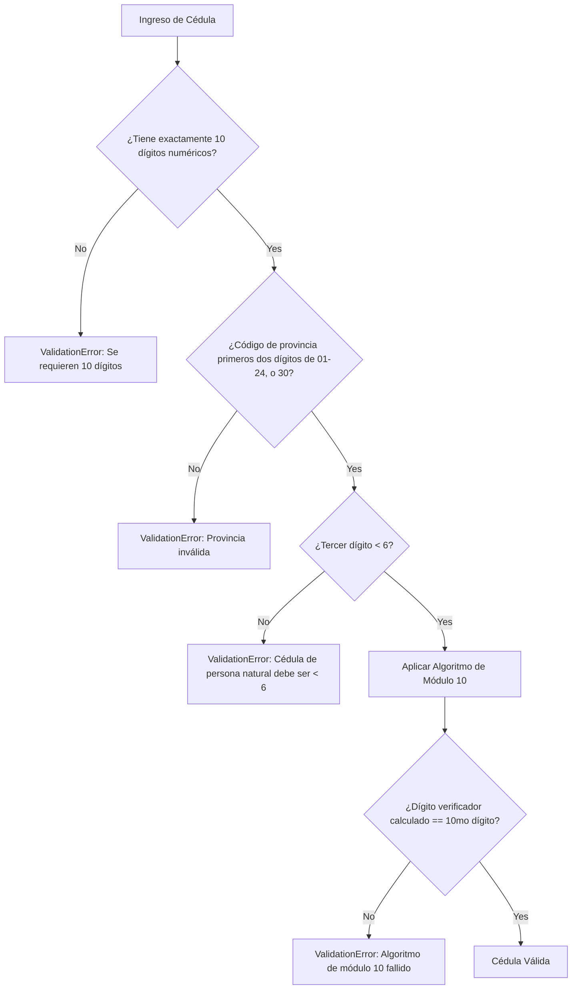
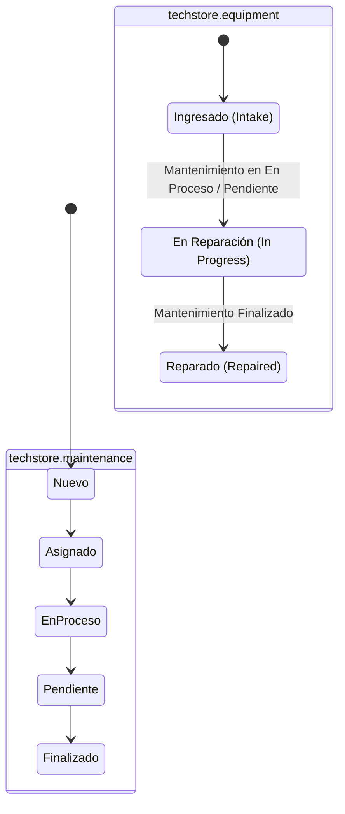

# TechStore Mantenimiento - Validaciones y Lógica de Negocio

Este documento detalla las validaciones de integridad de datos, las restricciones de campos y la lógica de sincronización de flujos de trabajo implementada en el módulo **TechStore Mantenimiento**.

---

## 1. Validación de Cédula Ecuatoriana mediante Módulo 10

Para asegurar la calidad y validez del registro de técnicos, el modelo `techstore.technician` implementa un validador estricto para la cédula de identidad ecuatoriana en [technician.py](file:///d:/universidad/septimo/GCS/TechStore_Maintenance/addons/techstore_maintenance/models/technician.py#L54-L85).

### Detalle Técnico del Algoritmo (Cédula de Persona Natural):
1. **Longitud:** La cadena recibida se limpia de espacios y debe tener exactamente 10 caracteres numéricos.
2. **Código de Provincia:** Los primeros dos dígitos representan la provincia de expedición. Deben estar en el rango de `01` a `24`, o ser igual a `30`.
3. **Tercer Dígito:** Debe ser menor a `6` (para diferenciar de RUCs de empresas privadas/públicas).
4. **Cálculo del Dígito Verificador:**
   * Se multiplican los primeros 9 dígitos alternando pesos de `[2, 1, 2, 1, 2, 1, 2, 1, 2]`.
   * Si el resultado de una multiplicación es mayor o igual a `10`, se le resta `9`.
   * Se suman todos los resultados parciales.
   * El total obtenido se somete a una operación módulo 10: `total % 10`.
   * El residuo se resta de `10`. Si el resultado de la resta es `10`, el dígito verificador calculado es `0`.
   * El dígito verificador calculado debe coincidir exactamente con el décimo dígito de la cédula ingresada.

---

## 2. Validación de Número Telefónico

El número telefónico del técnico se valida en [technician.py](file:///d:/universidad/septimo/GCS/TechStore_Maintenance/addons/techstore_maintenance/models/technician.py#L87-L95):
* Se eliminan caracteres no numéricos del valor del campo `phone`.
* Lanza un error de validación (`ValidationError`) si el valor resultante no contiene exactamente **10 dígitos** (por ejemplo: `0999999999`).

---

## 3. Requisitos Previos para Finalizar Mantenimientos

Antes de permitir que un ticket de mantenimiento pase al estado `finalizado`, Odoo evalúa la restricción de Python `_check_finalizado_fields` en [maintenance.py](file:///d:/universidad/septimo/GCS/TechStore_Maintenance/addons/techstore_maintenance/models/maintenance.py#L221-L238):

* **Diagnóstico Técnico:** El campo de texto `diagnosis` debe estar lleno y no puede consistir únicamente en espacios en blanco.
* **Solución Aplicada:** El campo de texto `solution` debe estar lleno y no puede consistir únicamente en espacios en blanco.
* **Costo Estimado:** El valor del campo `estimated_cost` debe ser estrictamente mayor a `0.0`.
* **Costo Final:** El valor del campo `final_cost` debe ser estrictamente mayor a `0.0`.
* **Fecha de Fin (`end_date`):** Debe cumplir las siguientes condiciones:
  1. No puede ser anterior a la fecha de inicio (`start_date`).
  2. No puede ser una fecha en el pasado (debe ser el día de hoy o una fecha futura).

Si alguna de estas condiciones no se cumple, Odoo bloquea la actualización y muestra un mensaje de advertencia.

---

## 4. Sincronización Automática de Estado del Equipo

El estado físico del equipo (`techstore.equipment`) se sincroniza bidireccionalmente con el ciclo de vida del ticket de mantenimiento (`techstore.maintenance`):

### Reglas de Sincronización:
* **Restricción de Ingreso:** Un usuario técnico solo puede registrar mantenimientos para equipos que estén físicamente en estado `'received'` (Ingresado). Intentar crear un ticket para un equipo en reparación lanza una advertencia (`_check_equipment_received`).
* **Copia de Descripción:** Si al crear el mantenimiento el campo `description` se deja vacío, el sistema copia automáticamente la descripción del problema (`problem_description`) registrada en el equipo asignado.
* **Estado de Recepción:** Al crear o asignar un mantenimiento (`nuevo` o `asignado`), el equipo asociado cambia su estado a `received`.
* **Estado de Reparación:** Cuando el mantenimiento pasa a `en_proceso` o `pendiente`, el equipo asociado cambia automáticamente su estado a `under_repair`.
* **Estado de Finalización:** Al pasar el ticket a `finalizado`, el equipo asociado cambia automáticamente su estado a `repaired`.

---

## 5. Guardia de Modificación Post-Finalización

Para preservar la consistencia de auditoría y evitar la manipulación accidental de costos finales o diagnósticos:
* Una vez que un ticket de mantenimiento entra en los estados de `finalizado` o `cancelado`, sus campos quedan bloqueados para edición.
* Cualquier intento de modificar campos críticos como cliente, equipo, técnico, costos, tiempos, o soluciones a través de la UI o llamadas API lanzará una excepción:
  *"No se puede modificar un mantenimiento que se encuentra en estado Finalizado o Cancelado."*
